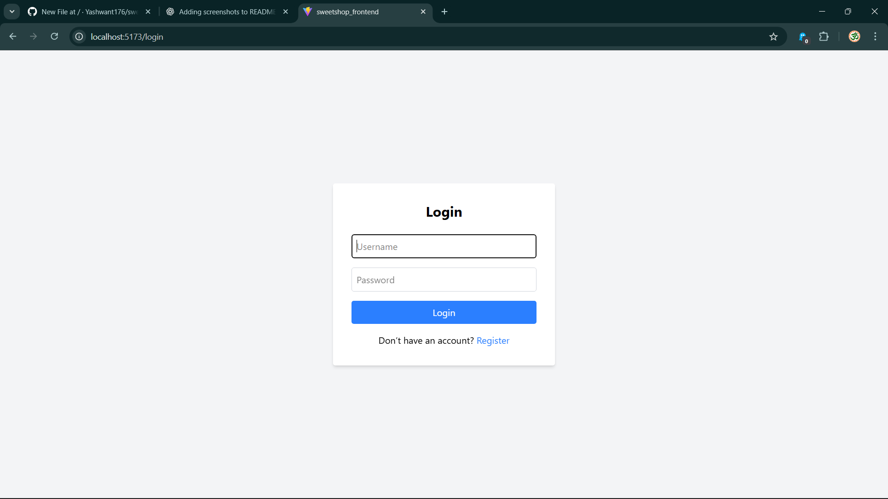
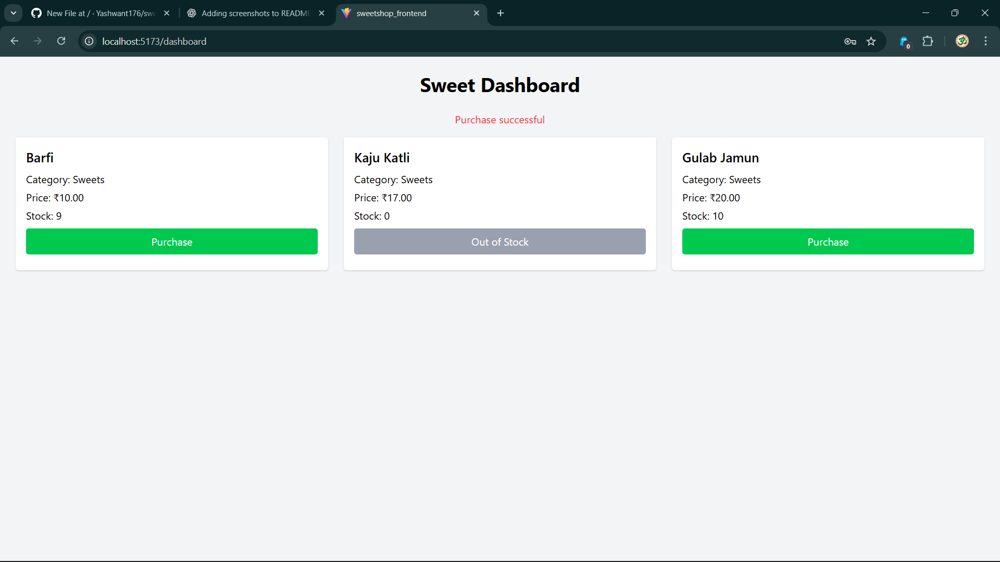
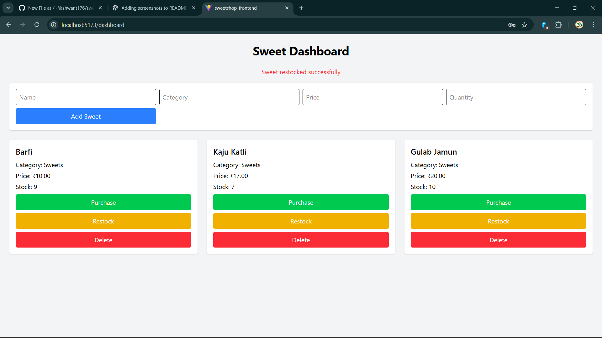

# Sweet Shop Management System

## Project Overview
The **Sweet Shop Management System** is a full-stack web application designed to manage sweets inventory, user authentication, and purchases.  
This project demonstrates skills in API development, database management, frontend implementation, testing, and modern development workflows, including responsible AI usage.

Users can:
- Register and log in.
- View available sweets.
- Search and filter sweets.
- Purchase sweets (quantity decreases automatically).

Admins can additionally:
- Add new sweets.
- Update sweet details.
- Delete sweets.
- Restock inventory.

---

## Technology Stack

**Backend:**
- Python 3.13
- Django 5.1
- Django REST Framework
- SQLite (database)
- JWT Authentication (via `djangorestframework-simplejwt`)
- CORS handling (`django-cors-headers`)

**Frontend:**
- React (Vite)
- TailwindCSS
- Axios for API requests
- React Router for SPA navigation

---

## Features

### User
- Registration & login
- View list of sweets
- Search by name or category
- Purchase sweets

### Admin
- All user features
- Add new sweets
- Update existing sweets
- Delete sweets
- Restock sweets

---

## Setup Instructions

### 1. Clone the Repository
```bash
git clone https://github.com/Yashwant176/sweetshop.git
cd sweetshop
```

### 2. Backend Setup
```bash
cd sweetshop_backend
virtualenv venv
venv/Scripts/activate
pip install -r requirements.txt
python manage.py migrate
python manage.py createsuperuser
python manage.py runserver
```

### 3. Frontend Setup
```bash
cd sweetshop_frontend
npm install
npm run dev
```
Frontend will run at http://localhost:5173/

Login page redirects to Dashboard

Admin users will see extra controls for add, restock, and delete

## Screenshots

### Login Page


### User Dashboard


### Admin Dashboard


## My AI Usage

I used AI tools to assist in development while following the project guidelines responsibly.

### Tools Used:

ChatGPT: Assisted with generating boilerplate code for Django views, React components, and API integration.

### How AI Was Used:

Generated initial structure for Django API views (CRUD and authentication endpoints)

Assisted with React component creation (Dashboard, Login, Admin actions)

Provided suggestions for TailwindCSS layout and form styling

Debugged errors and suggested solutions

### Reflection:
AI accelerated development by providing structured code and suggestions, but all logic, modifications, and integrations were verified and manually coded. AI was used as an augmentation tool, not a replacement for my own work.

## Tests

Backend tests implemented using Django’s built-in TestCase and DRF API testing utilities.

TDD approach followed: wrote tests first, then implemented the feature, and refactored.
```bash
python manage.py test
```
## Deplyment
Deployed on Render : https://sweetshop-frontend-9g5r.onrender.com

## GitHub Repository

https://github.com/Yashwant176/sweetshop

# Author

## K Yashwant Kumar
GitHub: https://github.com/Yashwant176

LinkedIn: https://www.linkedin.com/in/kyashwantkumar

Portfolio: https://yashwant.is-a.dev
